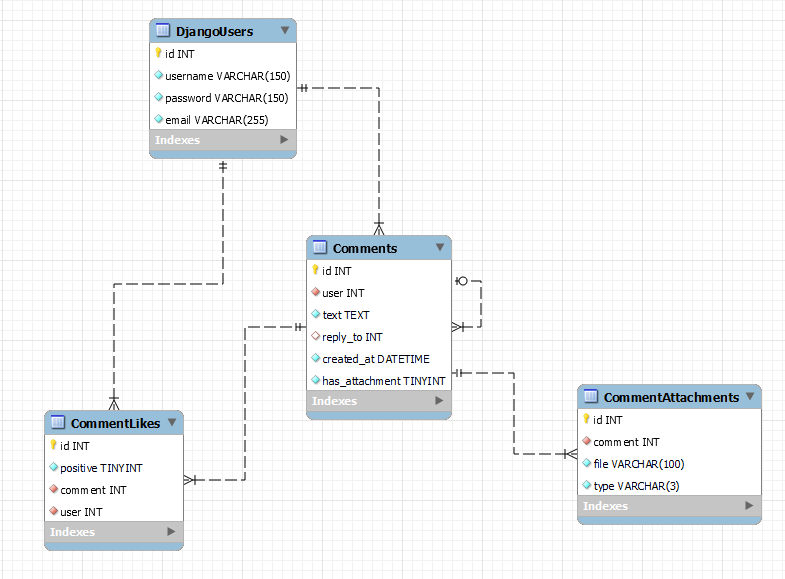

# Comment-System

## Quickstart

Firstly, clone the repository:

```shell
git clone https://github.com/CrazyProger1/TestTask-dZENcode
```

Change directory to [server](server):

```shell
cd ./TestTask-dZENcode/server/
```

Use `docker-compose`:

```shell
docker-compose -f compose.dev.yaml up
```

Create superuser:

```shell
docker-compose -f compose.dev.yaml run --entrypoint "python manage.py createsuperuser"  web
```

## API

See <a href="http://localhost:8000/docs/swagger/" target="_blank">swagger docs</a>.

Supported entities:

- <a href="http://localhost:8000/api/v1/users/" target="_blank">`users/`</a>
- <a href="http://localhost:8000/api/v1/comments/" target="_blank">`comments/`</a>
- <a href="http://localhost:8000/api/v1/comments/1/likes/" target="_blank">`comments/pk/likes/`</a>
- <a href="http://localhost:8000/api/v1/comments/1/attachments/" target="_blank">`comments/pk/attachments/`</a>
- <a href="http://localhost:8000/api/v1/comments/1/replies/" target="_blank">`comments/pk/replies/`</a>

Where `pk` - comment id

## Websockets

Supported events:

- `comments.create` - create comment
- `comments.read` - get paginated comment list
- `comments.replies.read` - get paginated list of comment-replies

### Schemas

Create comment schema:

```json
{
  "type": "comments.create",
  "data": {
    "text": "comment text",
    // required, comment text
    "reply_to": null
    // by default, parent comment id
  }
}
```

Successful response schema:

```json
{
  "type": "comments.create",
  "success": true,
  "data": {
    "id": 0,
    "likes_count": 0,
    "dislikes_count": 0,
    "text": "test comment",
    "created_at": "datatime",
    "has_attachment": false,
    "user": 0,
    "reply_to": null
  }
}
```

--- 

Read comments schema:

```json
{
  "type": "comments.read",
  "data": {
    "order_by": [
      "-created_at"
      // by default, order by creation date
    ],
    "filters": {
      "user": 0,
      // filter by user id
      "created_at": "",
      // filter by creation date
      "has_attachment": false
      // filter by attachments
    },
    "limit": 25,
    // by default, pagination limit
    "offset": 0
    // by default, pagination offset
  }
}
```

Successful response schema:

```json
{
  "type": "comments.read",
  "success": true,
  "data": {
    "count": 0,
    // all results count
    "results": [
      // paginated results
      {
        "id": 0,
        "likes_count": 0,
        "dislikes_count": 0,
        "text": "test comment",
        "created_at": "datatime",
        "has_attachment": false,
        "user": 0,
        "reply_to": null
      }
    ]
  }
}
```

---

Read replies schema:

```json
{
  "type": "comments.replies.read",
  "data": {
    "order_by": [
      "-created_at"
      // by default, order by creation date
    ],
    "filters": {
      "reply_to": 0,
      // filter by parent comment id
      "user": 0,
      // filter by user id
      "created_at": "",
      // filter by creation date
      "has_attachment": false
      // filter by attachments,
    },
    "limit": 25,
    // by default, pagination limit
    "offset": 0
    // by default, pagination offset
  }
}
```

Successful response schema:

```json
{
  "type": "comments.replies.read",
  "success": true,
  "data": {
    "count": 0,
    // all results count
    "results": [
      // paginated results
      {
        "id": 0,
        "likes_count": 0,
        "dislikes_count": 0,
        "text": "test comment",
        "created_at": "datatime",
        "has_attachment": false,
        "user": 0,
        "reply_to": 0
      }
    ]
  }
}
```

## Database

<p align="center">
    
</p>

## CodeCov

Using `docker-compose`:

```shell
docker-compose -f compose.dev.yaml run --entrypoint "python manage.py test"  web
```

**OR**

**Note:** _you need to have all requirements installed & environment variables specified (in development.env)._

Using terminal:

```shell
python mange.py test

# or using Make

make test

make coverage-report
```

Current coverage: 